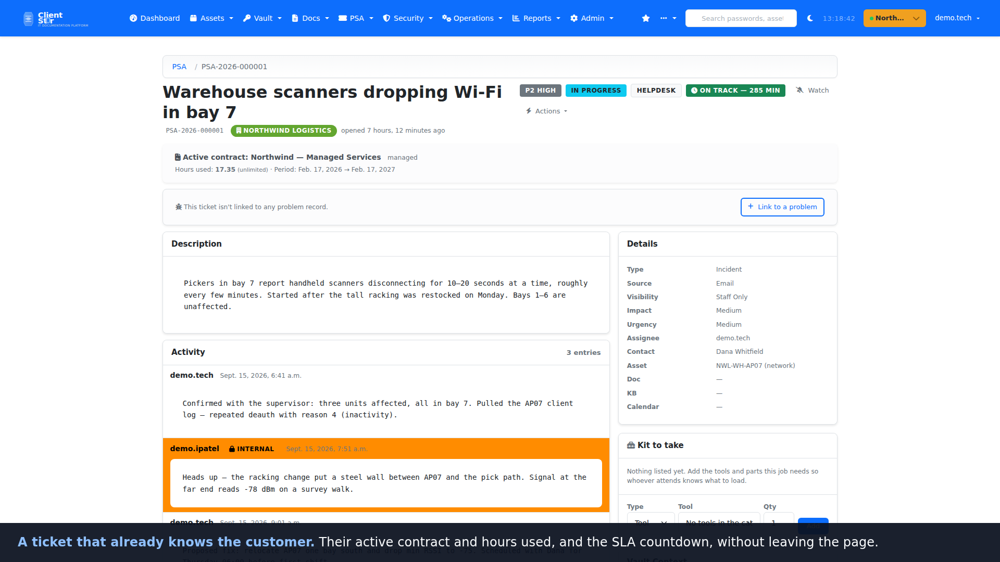

<div align="center">

<picture>
  <source media="(prefers-color-scheme: dark)" srcset="docs/images/github/clientst0r-wordmark-dark.svg">
  
</picture>

**Self-hosted IT documentation and service desk for MSPs.**

Keep customer documentation, assets, credentials and support workflows on your own infrastructure — one place for the runbook, the device it describes, the credential it needs, and the ticket it came from.

[](LICENSE) [](https://github.com/agit8or1/clientst0r/releases) [](https://github.com/agit8or1/clientst0r/actions/workflows/codeql.yml) [](https://github.com/agit8or1/clientst0r/actions/workflows/docker-image.yml)

[Quick Start](#quick-start) · [Screenshots](docs/screenshots.md) · [Walkthrough](#watch-it-work) · [Documentation](#documentation) · [Releases](https://github.com/agit8or1/clientst0r/releases) · [Report a bug](https://github.com/agit8or1/clientst0r/issues/new?template=bug_report.yml) · [MSP Reboot](https://mspreboot.com)

</div>

---

[](docs/images/github/client-dashboard-light.png)

## Watch it work

[](docs/images/github/walkthrough.gif)

**[▶ Watch the full 3-minute walkthrough (MP4, 4.5 MB)](https://github.com/agit8or1/clientst0r/releases/download/v3.17.558/clientst0r-walkthrough.mp4)**
— or the [56-second highlight](https://github.com/agit8or1/clientst0r/releases/download/v3.17.558/clientst0r-walkthrough-highlight.mp4).
The animation above is a 34-second excerpt.

It runs through three end-to-end workflows — a ticket from queue to runbook, the week
scheduled on the dispatch board and a project plan, and quote to invoice to profitability
— with a deliberate light-to-dark transition partway. It is caption-led; there is no
narration track. [Transcript](docs/media/walkthrough.txt) ·
[captions](docs/media/walkthrough.vtt) · regenerate it, or the screenshots, with
[`scripts/demo/`](scripts/demo/README.md).

## Why MSPs run it

**Documentation that sits next to the work.** A ticket opens with the client's active
contract, the asset it concerns, the runbook that covers it and the vault entries the
technician will need — without leaving the ticket or opening a second product. Secrets are
never rendered into the ticket page; opening one goes through the vault's own permissions
and is logged.

**A service desk you own, not one you rent.** Queues, SLA timers with pause logic, time
entries, quotes, invoices, contracts, projects, approvals and workflow rules are built in
and run on your server. Your ticket history and your client data stay in your database, on
your hardware, under your backup policy.

**One tenant per client, from day one.** Every asset, document, credential, location and
ticket belongs to an organization. Technicians switch client context in one click;
role-based membership decides who sees what. Multi-site clients, parent/child
organizations and per-client PSA settings are first-class, not bolted on.

## See it in action

A ticket that already knows the customer — contract, SLA countdown, internal notes kept
apart from client replies, and the credentials the job needs, listed but never revealed.

[](docs/images/github/ticket-detail-light.png)

<table>
<tr>
<td width="50%" valign="top">
<a href="docs/images/github/ticket-queue-dark.png"></a>
<b>One queue, every client</b> · Dark<br>Filter by status, priority, queue or technician.
</td>
<td width="50%" valign="top">
<a href="docs/images/github/dispatch-board-dark.png"></a>
<b>Dispatch the week</b> · Dark<br>Drag a ticket onto a technician; breaches surface up top.
</td>
</tr>
<tr>
<td width="50%" valign="top">
<a href="docs/images/github/rack-elevation-dark.png"></a>
<b>What is actually in the rack</b> · Dark<br>Each device linked to its asset record.
</td>
<td width="50%" valign="top">
<a href="docs/images/github/project-timeline-light.png"></a>
<b>Projects with dependencies</b> · Light<br>Drag a bar to reschedule; blocked work is flagged.
</td>
</tr>
<tr>
<td width="50%" valign="top">
<a href="docs/images/github/vault-dark.png"></a>
<b>Credentials, never on screen</b> · Dark<br>AES-GCM at rest; every reveal audited.
</td>
<td width="50%" valign="top">
<a href="docs/images/github/report-profitability-light.png"></a>
<b>What the month earned</b> · Light<br>Revenue against cost of delivery, from logged time.
</td>
</tr>
</table>

**[See all 28 screenshots →](docs/screenshots.md)** — light and dark, across documentation,
the service desk, dispatch, projects, reporting and administration.

## Quick Start

### Docker (recommended)

Requires Docker Engine 24.0+ with the Compose v2 plugin, about 2 GB of disk for the image
and 1 GB for the database volume.

```bash
git clone https://github.com/agit8or1/clientst0r.git
cd clientst0r
cp .env.example .env
# edit .env — at minimum: SECRET_KEY, DB_PASSWORD, DB_ROOT_PASSWORD, APP_MASTER_KEY
docker compose up -d
```

Open `http://localhost:8000`. The entrypoint runs migrations and collects static files on
first boot; set `DJANGO_SUPERUSER_*` in `.env` and it creates the admin account too.
Pre-built images are published to `ghcr.io/agit8or1/clientst0r`.

Optional services are behind compose profiles:

```bash
docker compose --profile proxy up -d   # Nginx + TLS on 80/443
docker compose --profile cache up -d   # Redis (only if you switch CACHES to Redis)
```

Full guide: **[docs/docker.md](docs/docker.md)**.

### Native install on Ubuntu or Debian

Ubuntu 20.04+ / Debian 11+, 2 GB RAM (4 GB recommended), 10 GB free disk. The installer
adds Python 3.12, MariaDB, Gunicorn and the systemd units, generates the encryption keys,
runs migrations and starts the service.

```bash
git clone https://github.com/agit8or1/clientst0r.git && cd clientst0r && bash install.sh
```

It detects an existing installation and offers upgrade, system check or clean reinstall.
Full guide: **[INSTALL.md](INSTALL.md)**.

### First steps after install

1. Sign in and enrol 2FA — it is enforced for every account by default.
2. Create your first client organization under **Admin → Organizations**.
3. Turn the service desk on under **Admin → System → Settings → Feature Toggles** (`psa_enabled` is off by
   default, so the PSA menu stays hidden until you switch it on).

## Updating and backups

**Update** from **Admin → System → System Updates** in the web UI: *Check for Updates*, then *Apply*.
The apply step is a graceful reload — no manual service restart.

CLI fallback:

```bash
git pull && python manage.py migrate && sudo systemctl restart clientst0r-gunicorn.service
```

Under Docker, `docker compose pull && docker compose up -d`.

**Back up before every upgrade.** The bundled command writes the database and media to a
single archive:

```bash
python manage.py backup --output-dir /var/backups/clientst0r --encrypt --retention-days 30
```

Docker users: see [Backups](docs/docker.md#backups) for the volume-level equivalent.

## Supported versions and limitations

- Security fixes land on the current **3.17.x** line. See [SECURITY.md](SECURITY.md).
- **Single-server by design.** There is no clustered or multi-node deployment story; it
  targets one VM or one container host per MSP.
- **Self-hosted only.** There is no hosted service and no public demo instance — you run it.
- **The service desk is opt-in.** `psa_enabled` is off until an administrator turns it on.
- **AI-assisted features are optional** and gated behind `psa_ai_enabled`. Nothing calls an
  external model unless you enable it and supply a key.
- Third-party PSA and RMM integrations (ConnectWise, Autotask, HaloPSA, NinjaOne, Datto RMM,
  Syncro, Atera and others) are supported for teams that already run one — but the service
  desk here is native, not a front end for someone else's.

## Security

- Enforced TOTP 2FA, Argon2 password hashing, brute-force lockout, session timeouts.
- AES-GCM encryption at rest for vault entries, integration credentials and API keys.
- Per-entry vault access rules, approval and break-glass flows, audited reveals.
- Optional Azure AD / Entra ID SSO and LDAP / Active Directory authentication.
- CodeQL and dependency scanning run on every push to `main` and weekly.

**Found a vulnerability?** Please report it privately via
[GitHub Security Advisories](https://github.com/agit8or1/clientst0r/security/advisories/new)
rather than a public issue. Full policy and response timelines: [SECURITY.md](SECURITY.md).

## Documentation

| Guide | What it covers |
|---|---|
| [Installation](INSTALL.md) | Native install, upgrade, troubleshooting |
| [Docker](docs/docker.md) | Compose layout, profiles, backups, upgrades |
| [Features](FEATURES.md) | Full capability list by area |
| [Screenshots](docs/screenshots.md) | Complete visual tour |
| [Roadmap](docs/ROADMAP.md) | Shipped, in progress and planned phases |
| [Changelog](CHANGELOG.md) | Release history |
| [Integrations](docs/INTEGRATION_SETUP_GUIDE.md) | Connecting PSA, RMM, M365, accounting and distributors |
| [API](API_V2_GRAPHQL.md) | REST and GraphQL endpoints |
| [Security](SECURITY.md) | Policy, supported versions, reporting |
| [FAQ](docs/faq.md) | Common questions |
| [More docs](docs/README.md) | Everything else |

## Contributing

Issues and pull requests are welcome.

- **Bugs:** [open a bug report](https://github.com/agit8or1/clientst0r/issues/new?template=bug_report.yml)
- **Ideas:** [open a feature request](https://github.com/agit8or1/clientst0r/issues/new?template=feature_request.yml)
- **Code:** fork, branch, add a test in the relevant app's `tests.py`, run
  `python manage.py test <app>`, then open a PR. See [CONTRIBUTING.md](CONTRIBUTING.md).

## Support

Questions and troubleshooting go in [GitHub Issues](https://github.com/agit8or1/clientst0r/issues)
or [Discussions](https://github.com/agit8or1/clientst0r/discussions).

## License

MIT — see [LICENSE](LICENSE). Use it, fork it, run it for your clients.

## MSP Reboot

ClientSt0r is built by the people behind **[MSP Reboot](https://mspreboot.com)** — an MSP
consulting practice run by a former 25-year MSP owner, working with owners on pricing,
operations, margins, service delivery and technology strategy.

The consulting and this software are separate things: ClientSt0r is MIT-licensed and
self-hosted, and nothing here requires an engagement. There is no paid support tier and no
service-level commitment attached to the project — if you want commercial help with your
operation rather than with the software, that is what mspreboot.com is for.

---

<div align="center">

If ClientSt0r saves you time, a ⭐ helps other MSPs find it.

<sub>Built by a small team and one German Shepherd. 🐕 Luna supervises.</sub>

</div>
