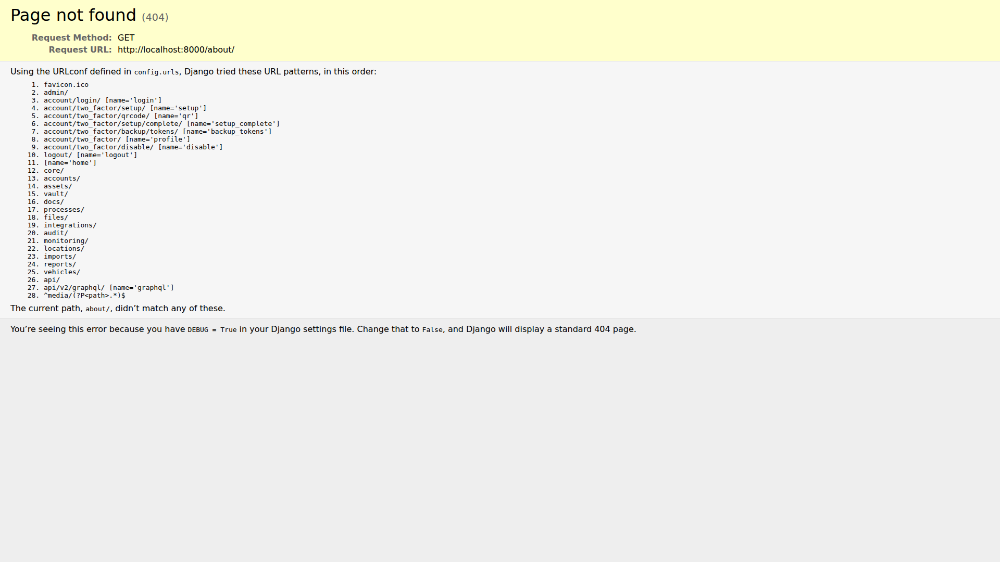

# Client St0r Screenshots

**Version:** v2.24.52
**Date:** January 2026
**Total Screenshots:** 34

All screenshots showcase Client St0r with random backgrounds enabled and include demo data watermarks.

---

## 🏠 Core Features

### Dashboard

### Quick Add

### About

### Profile

### Favorites

---

## 📦 Asset Management

### Assets List

### Racks

### Network Closets

### IPAM/Subnets

### VLANs

### Locations

---

## 🔐 Password Vault & Security

### Password Vault

### Personal Vault

### Secure Notes

---

## 📚 Documentation & Knowledge Base

### Knowledge Base

### Diagrams

### Floor Plans Import

---

## 🔄 Workflows & Processes

### Workflows

---

## 🌐 Monitoring & Expirations

### Website Monitors

### Expirations

---

## 🔒 Security & Scanning

### Security Dashboard

### Vulnerability Scans

### Scan Configuration

---

## ⚙️ System Administration

### General Settings

### System Status

### System Updates

### Organizations

### Access Management

### Integrations

### Import Data

---

## 🌍 MSP/Global Features (Staff Only)

### Global Dashboard

### Global Knowledge Base

### Global Workflows

---

## 📝 Login Page

### Login

---

**Client St0r** - Self-Hosted IT Documentation Platform
https://github.com/agit8or1/clientst0r
