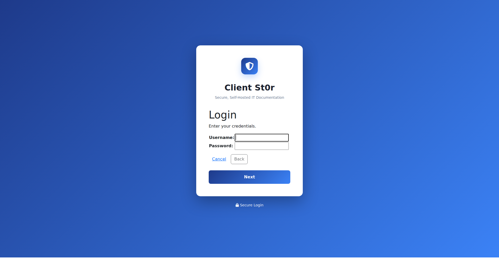

# ClientSt0r screenshots — archive

> **This is the archive.** The current visual tour lives at
> [`docs/screenshots.md`](../screenshots.md), captured against the current release.
> The images below are from **v3.13.68 (March 2026)** and show older styling, but cover
> feature areas that have not been recaptured — PSA quotes and invoices, the dispatch
> board, workflow rules, contracts, compliance frameworks, security alert ingestion,
> integration setup forms, monitoring, racks, IPAM, wallboards and fleet inventory.

All screenshots use demo data.

---

## 🏠 Core Features

### Dashboard

### Quick Add

### Profile

### Favorites

---

## 📦 Asset Management

### Assets List

### Racks

### Network Closets

### IPAM/Subnets

### VLANs

### Locations

---

## 🔐 Password Vault & Security

### Password Vault

### Personal Vault

### Secure Notes

---

## 📚 Documentation & Knowledge Base

### Knowledge Base

### Diagrams

### Floor Plans Import

---

## 🔄 Workflows & Processes

### Workflows

---

## 🌐 Monitoring & Expirations

### Website Monitors

### Expirations

---

## 🔒 Security & Scanning

### Security Dashboard

### Vulnerability Scans

### Scan Configuration

---

## ⚙️ System Administration

### General Settings

### System Status

### System Updates

### Organizations

### Access Management

### Integrations

### Import Data

---

## 🌍 MSP/Global Features (Staff Only)

### Global Dashboard

### Global Knowledge Base

### Global Workflows

---

## 📝 Login Page

### Login

---

## 🚗 Service Vehicles & Inventory

### Vehicles Dashboard

### Vehicle List

### Inventory (Unified View)

### Inventory — By Vehicle

### Inventory — Shop

### Shop Inventory Item Edit (with QR code)

### Vehicle Inventory Item Edit (with QR code)

### QR Code Print Sheet

---

## 🛡️ Security Alert Ingestion

Unified triage queue for EDR / AV / firewall alerts from any vendor, plus auto-ticket
rules that fire on matching inbound alerts.

### Alert triage queue

### Vendor connections

### New vendor connection

### Auto-ticket rules

### New auto-ticket rule

---

## 🔌 Integration Connection Forms

### New UniFi connection

### New Microsoft 365 connection

---

## 📺 Wallboards

TV-ready big-number displays, configurable per organization.

### Wallboard list

### New wallboard

---

## 🎫 Service Desk — additional views

### Dispatch heatmap

### Recurring ticket schedule form

### Organizations grid

### Processes

---

## 🧾 Vehicle Receipt Scanning

### Receipt list and cost summary

### Add receipt

---

## 📱 Install App / Phone Shortcut

### Install App page

### Phone shortcut

---

## 🗺️ Live Roadmap

The roadmap renders in-app from `docs/ROADMAP.md`, and is also published to the About-page
card and a polling-friendly JSON feed at `/core/roadmap.json`.

---

**ClientSt0r** — self-hosted IT documentation and service desk for MSPs
https://github.com/agit8or1/clientst0r
